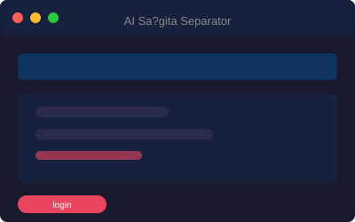

<div align="center">
  
</div>

<h1 align="center">🎵 AI Saṅgīta — Vocal & Instrument Separator</h1>

<p align="center">
  <strong>Powered by Spleeter · Built with Streamlit · Pure Python</strong>
  <br>
  Upload any song → Split into Vocals & Instrumental → Preview → Download → Record Voice-Over
</p>

<p align="center">
  
  
  
  
  
  
</p>

---

## ✨ Features

| Feature | Description |
|---------|-------------|
| 🔐 **Login Page** | Sign in with your Gmail address (no OTP required) |
| 📤 **Audio Upload** | Upload `.mp3` or `.wav` files via the Streamlit UI |
| 🧠 **AI Separation** | Split songs into vocals & instrumental using Spleeter deep learning |
| ▶️ **Preview & Playback** | Listen to original, vocals, and instrumental tracks in-browser |
| ⬇️ **Download Results** | Download separated files with one click |
| 🎙️ **Voice-Over Recording** | Record from microphone and overlay on instrumental |
| 💾 **Auto-Save** | All generated files saved to local output folders |
| ℹ️ **About / Help Page** | Learn how the app works, tech stack, and usage tips |

---

## 🖼️ App Screenshots

| Page | Preview |
|------|---------|
| **Login Page** |  |
| **Home Page** |  |
| **Audio Upload** |  |
| **Processing** |  |
| **Vocal Output** |  |
| **Instrumental Output** |  |
| **Download Results** |  |
| **About / Help** |  |

---

## 🛠️ Tech Stack

| Technology | Purpose |
|------------|---------|
| **Python 3.10** | Core programming language |
| **Streamlit** | Web UI framework |
| **Spleeter** | Pre-trained model for source separation |
| **TensorFlow** | Deep learning backend (Spleeter) |
| **Librosa** | Audio analysis & feature extraction |
| **SoundFile** | Reading / writing audio files |
| **Pydub** | Audio format conversion & mixing |
| **NumPy** | Numerical operations on audio arrays |
| **Pandas** | Data handling & analysis |

---

## 📁 Project Structure

```
project/
├── app.py                  # Main Streamlit application (multi-page)
├── audio_processing.py     # Spleeter separation logic
├── utils.py                # Helper utilities
├── requirements.txt        # Python dependencies
├── .gitignore
├── README.md
├── screenshots/            # Screenshot images & banner
├── uploads/                # Uploaded audio files
│   └── .gitkeep
├── outputs/
│   ├── vocals/             # Extracted vocal stems
│   ├── instrumental/       # Extracted instrumental stems
│   └── voiceovers/         # Mixed voice-over outputs
└── pretrained_models/      # Spleeter model cache
```

---

## 🚀 Quick Start

### 1. Clone & Enter

```bash
git clone https://github.com/Harsha240105/Sa-g-ta-.git
cd Sa-g-ta-
```

### 2. Virtual Environment

```bash
python -m venv .venv
# Windows
.venv\Scripts\activate
# macOS / Linux
source .venv/bin/activate
```

### 3. Install Dependencies

```bash
pip install -r requirements.txt
```

### 4. Install FFmpeg

| OS | Command |
|----|---------|
| **Windows** | Download from [ffmpeg.org](https://ffmpeg.org) and add to `PATH` |
| **macOS** | `brew install ffmpeg` |
| **Ubuntu/Debian** | `sudo apt install ffmpeg` |

### 5. Run the App

```bash
streamlit run app.py
```

Open **http://localhost:8501** in your browser.

---

## 📖 Usage Guide

1. **Login** – Enter your Gmail address and click **Login**.
2. **Home** – Upload an MP3 or WAV file.
3. **Upload** – Preview the selected audio file.
4. **Process** – Click **Process Audio** to run Spleeter separation.
5. **Vocals** – Preview the extracted vocal track.
6. **Instrumental** – Preview the accompaniment track.
7. **Download** – Save Original, Vocals, and Instrumental files.
8. **Voice-Over** – Record from your mic and click **Create Voice-Over Mix**.
9. **About** – Learn more about the app and tech stack.

---

## ⚠️ Notes

- First run downloads Spleeter model weights (~300 MB, internet required once).
- Recommended Python version: **3.10** for dependency compatibility.
- Generated files saved under `uploads/` and `outputs/`.
- Make sure `ffmpeg` and `ffprobe` are accessible from your terminal.

---

## 👤 Owner

<div align="center">
  <a href="https://github.com/Harsha240105">
    
  </a>
  <br>
  <sub>Built with ❤️ by <a href="https://github.com/Harsha240105">Harsha240105</a></sub>
</div>

---

## 📄 License

This project is licensed under the **MIT License**. See the [LICENSE](LICENSE) file for details.
